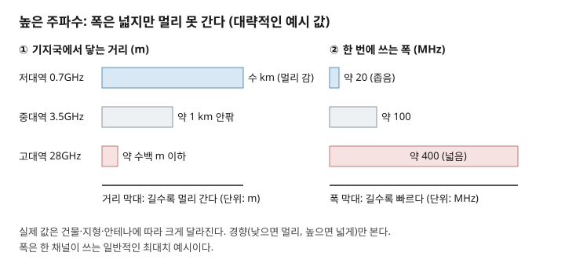
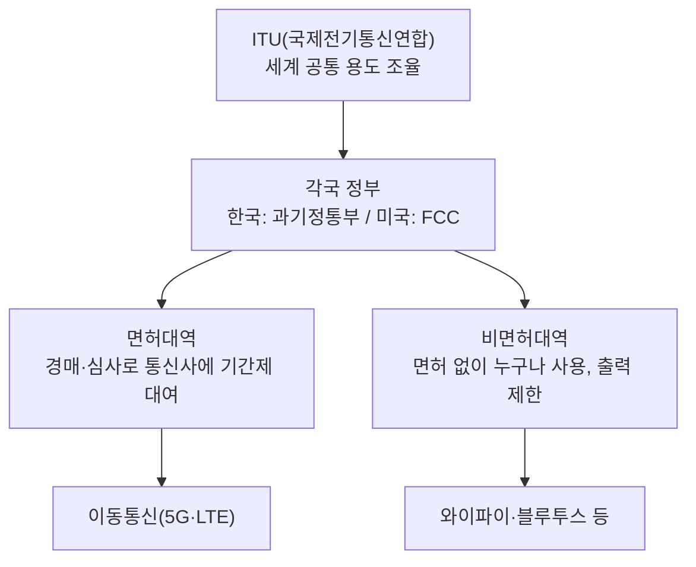

# 주간 통신 브리핑 — 2026-10-06

> ※ 지난 리포트는 2026-09-22였습니다. 14일 공백이 있어 그 사이(09-22~10-06) 소식까지 넓혀 수집했습니다.

> 이번 주 배울 것: 낮은 주파수는 멀리 가고 높은 주파수는 넓지만 약한 이유, 그리고 주파수를 국가가 나눠주는 이유를 이해합니다.

## 0. 30초 요약

- 낮은 주파수는 벽을 잘 넘고 멀리 갑니다. 대신 쓸 수 있는 폭이 좁습니다.
- 높은 주파수는 폭이 넓어 빠릅니다. 대신 벽에 막히고 멀리 못 갑니다.
- 같은 장소에서 같은 주파수를 둘이 쓰면 신호가 뒤섞입니다. 그래서 국가가 용도와 사용자를 정해 나눠줍니다.
- 이번 소식: 3GPP는 6G 주파수 범위를 논의했고, 미국은 중대역 경매를 정했고, 영국은 6GHz 대역을 와이파이와 이동통신이 나누게 했습니다.

## 1. 지난주 복습

주파수는 전파가 1초에 출렁이는 횟수이고, 높을수록 파장이 짧아집니다.
대역폭은 통신에 쓰는 주파수 범위의 폭이며, 넓을수록 한 번에 더 많은 데이터를 보냅니다.
주파수는 대역폭이 놓인 "위치"이고, 속도를 정하는 것은 "폭"입니다.

**확인 문제**: 속도를 결정하는 것은 주파수일까요, 대역폭일까요?
정답: 대역폭입니다. (2026-09-22 리포트 3절 참고)

## 2. 이번 주 개념① — 주파수 대역별 성질

### 문제부터
5G 뉴스에는 늘 "저대역", "중대역", "고대역"이 나옵니다.
고대역은 빠르다는데 왜 전국 어디서나 쓰지 않을까요?
대역마다 성질이 다르다는 것을 모르면 이 질문에 답할 수 없습니다.

### 정의
주파수 대역별 성질이란, 주파수가 높고 낮음에 따라 전파가 달리 행동하는 특성입니다.
대략 1GHz 이하를 저대역, 1~6GHz 부근을 중대역, 24GHz 이상을 고대역이라 부릅니다.

### 동작 원리
전파는 퍼지면서 약해집니다. 이를 감쇠(減衰, 신호가 약해지는 현상)라고 합니다.
주파수가 높을수록 같은 거리에서 더 많이 약해집니다.
이유는 이렇습니다. 파장이 짧으면 수신 안테나가 받아내는 면적이 작아져, 같은 전파에서 건지는 에너지가 줄어듭니다.
또 파장이 짧으면 벽과 유리, 사람 몸에 흡수되거나 반사되는 비율이 커집니다.
파장이 긴 저대역 전파는 건물 모서리를 돌아 들어갑니다.
반면 낮은 주파수 구간은 이미 여러 서비스가 차지해 폭을 넓게 쓰기 어렵습니다.
높은 주파수 구간은 비어 있는 폭이 넓어서, 한 채널에 400MHz 같은 넓은 폭을 줄 수 있습니다.
폭이 넓으면 빠르다는 것은 지난 리포트에서 배웠습니다.

**이 그림에서 볼 것**: 거리 막대는 아래로 갈수록 짧아지고, 폭 막대는 아래로 갈수록 길어집니다. 두 막대가 반대로 움직입니다.

### 체감 사례
집 와이파이 2.4GHz는 방 몇 개를 건너도 잡힙니다. 5GHz는 속도가 빠르지만 벽 한두 개에 확 약해집니다.
엘리베이터나 지하에서 5G 표시가 사라지는 것도 같은 원리입니다.
그래서 통신사는 전국에는 저·중대역을 깔고, 고대역은 경기장·역사 같은 좁은 곳에 둡니다.

### 흔한 오해
"높은 주파수가 항상 더 좋은 기술"이라고 생각하기 쉽습니다.
높은 주파수는 빠르지만 닿는 거리가 짧아 기지국이 훨씬 많이 필요합니다.
좋고 나쁨이 아니라 거리와 폭의 맞교환입니다.

### 한 줄 정리
결국 주파수 대역별 성질이란, 낮으면 멀리 가고 높으면 넓게 쓴다는 맞교환이다.

지난주에 배운 대역폭과 이렇게 이어집니다: 높은 대역이 빠른 이유가 바로 넓은 대역폭이고, 그 대가가 짧은 거리입니다.

---

## 3. 이번 주 개념② — 주파수는 왜 국가가 나눠주는가

### 문제부터
주파수가 누구나 쓸 수 있는 공짜라면 어떻게 될까요?
같은 장소에서 두 송신기가 같은 주파수로 동시에 보내면 수신기는 둘이 섞인 소리만 듣습니다.
이 뒤섞임을 간섭(干涉)이라고 합니다. 통신, 방송, 군, 항공이 서로 방해하면 모두 못 씁니다.

### 정의
주파수 배분이란, 국가가 대역마다 용도와 사용자를 정해 간섭 없이 쓰게 하는 제도입니다.

### 동작 원리
먼저 국제전기통신연합(International Telecommunication Union, ITU)이 세계적으로 대역의 큰 용도를 조율합니다.
비행기와 위성은 국경을 넘기 때문에 나라마다 제각각이면 곤란하기 때문입니다.
그 위에서 각 나라 정부가 세부를 정합니다. 한국은 과학기술정보통신부, 미국은 연방통신위원회(FCC)입니다.
정부는 이동통신 대역을 사업자에게 일정 기간 빌려줍니다. 방식은 경매나 심사입니다.
이를 면허대역이라 하며, 면허 가진 사업자만 해당 대역에 전파를 보낼 수 있습니다.
기간이 끝나면 다시 빌려주는 재할당을 합니다.
와이파이 같은 대역은 면허가 필요 없는 비면허대역입니다. 대신 출력을 약하게 제한하고, 누구나 쓰기에 혼잡해집니다.

**이 그림에서 볼 것**: 주파수가 위에서 아래로 내려가며 나뉩니다. 갈림길에서 통신사용(면허)과 모두의 것(비면허)으로 갈립니다.

### 체감 사례
통신사 5G는 서로 다른 대역을 따로 쓰기 때문에 옆자리 사람과 신호가 섞이지 않습니다.
반면 아파트 단지에서 와이파이가 느린 것은 이웃집들이 같은 비면허대역을 함께 쓰기 때문입니다.
2026년에 사용 기간이 끝나는 3G·LTE 주파수 370MHz 폭의 재할당이 한국에서 논의됐다고 2025년 말 보도가 있었습니다.

### 흔한 오해
"통신사가 주파수를 산 것"이라고 생각하기 쉽습니다.
실제로는 정해진 기간 동안 쓸 권리를 얻은 것이고, 기간이 끝나면 다시 정부와 협의합니다.

### 한 줄 정리
결국 주파수 배분이란, 간섭을 막으려고 국가가 대역을 용도별로 나눠 빌려주는 제도이다.

개념①에서 배운 "대역마다 성질이 다르다"는 점이, 대역마다 가격과 용도가 다른 이유가 됩니다.

---

## 4. 개념으로 읽는 이번 주 뉴스

### ① 3GPP, 6G 주파수 범위·5G와 6G 공존 논의 (RAN#113) ★★

- **쉬운 설명**: 3GPP는 이동통신 표준을 정하는 국제 협의체입니다. 9월 15~17일 마드리드 회의에서 6G가 5G 장비와 어떻게 함께 동작할지를 논의했습니다. 같은 주파수에서 5G와 6G를 함께 돌릴 때 드는 부담도 평가했습니다. 6G가 쓸 후보 범위는 7.125GHz 이하, 7GHz 부근, 24.25~52.6GHz로 논의돼 왔습니다. 아직 최종 확정은 아닙니다.
- **개념과의 연결**: 개념①의 저·중·고대역이 6G에서도 모두 후보에 오른 것이고, 6G가 쓸 대역을 정하는 일은 개념②의 주파수 배분과 맞물립니다.
- **원문 링크(2026-09-22)**: [IEEE ComSoc 기술블로그 "Sept 2026 3GPP meeting updates for 5G Advanced and 6G planning"](https://techblog.comsoc.org/2026/09/22/sept-2026-3gpp-meeting-updates-for-5g-advanced-and-6g-planning-with-timeline-for-submisson-to-itu-r-wp-5d/) (본문 접근 차단, 검색 스니펫으로 확인)

### ② 미국 FCC, 상부 C밴드(3.98~4.2GHz) 160MHz 경매 확정 ★★

- **쉬운 설명**: 2026년 7월 22일 FCC가 3.98~4.2GHz 중 160MHz 폭을 이동통신용으로 경매하기로 했습니다. 이미 쓰는 아래쪽 대역과 합치면 3.7~4.14GHz에 걸친 440MHz 폭의 넓은 중대역이 됩니다. 경매는 2027년 7월 4일 이전에 끝내야 합니다.
- **개념과의 연결**: 중대역은 거리와 폭의 균형이 좋아 값이 비쌉니다(개념①). 정부가 경매로 빌려주는 면허대역의 실제 사례입니다(개념②).
- **원문 링크(2026-07-22)**: [NewscastStudio "FCC adopts rules for upper C-band auction, sets stage for 440 MHz 'super band'"](https://www.newscaststudio.com/2026/07/22/fcc-adopts-rules-for-upper-c-band-auction-sets-stage-for-440-mhz-super-band/) (검색 스니펫으로 확인)

### ③ 영국 Ofcom, 상부 6GHz를 와이파이와 이동통신이 나눠 쓰게 결정 ★★

- **쉬운 설명**: 영국 통신 규제기관 Ofcom이 2026년 7월 20일 결정을 냈습니다. 6425~6585MHz는 와이파이가 우선하고, 6585~7125MHz는 이동통신이 우선합니다. 와이파이는 우선 구간에서 면허 없이 실내 저출력으로 쓰고, 이동통신 우선 구간에서도 조정 시스템의 허락 아래 쓸 수 있습니다.
- **개념과의 연결**: 한 대역을 면허대역과 비면허대역으로 나눠 간섭을 막는 사례입니다(개념②). 6GHz는 중대역 위쪽이라 폭이 넓은 대신 실내 위주로 쓰입니다(개념①).
- **원문 링크(2026-07-20)**: [Ofcom 공식 결정문 "Expanding access to the 6 GHz band for commercial mobile and Wi-Fi services"](https://www.ofcom.org.uk/spectrum/innovative-use-of-spectrum/consultation-expanding-access-to-the-6-ghz-band-for-commercial-mobile-and-wi-fi-services/) · [LexisNexis 뉴스 2026-07-20](https://www.lexisnexis.co.uk/legal/news/ofcom-confirms-prioritised-spectrum-sharing-framework-for-upper-6-ghz-band)

## 5. 그 밖의 소식

- **TTA ICT Standard Weekly 제1310호**: "2028·2030 AI 노동시장 시나리오 분석" — 통신 기술과 직접 관련 없는 AI 노동 주제. [TTA 위클리 목록](https://committee.tta.or.kr/data/weekly_list.jsp) (제목만 확보)
- **IITP 주간기술동향 제2221호(2026-09-23)**: "AI 공급망 보안 위협과 ISO/IEC 42001 기반 대응 동향" 등. [IITP 목록](https://www.itfind.or.kr/publication/regular/weeklytrend/weekly/list.do)

## 6. 이해 점검 퀴즈

**Q1.** 저대역 전파가 고대역보다 멀리 가는 이유로 가장 알맞은 것은?
a) 파장이 길어 덜 약해지고 장애물을 잘 돌아간다 b) 속도가 더 빠르다 c) 전기를 더 많이 쓴다 d) 안테나가 크다

**Q2.** 고대역이 빠른 이유는?
a) 전파가 빨리 날아가서 b) 넓은 폭(대역폭)을 줄 수 있어서 c) 기지국이 적어서 d) 벽을 뚫어서

**Q3.** 고대역 5G를 전국이 아니라 경기장·역 같은 곳에 주로 두는 이유는?
a) 법으로 금지돼서 b) 멀리 못 가고 벽에 약해 기지국이 많이 필요해서 c) 속도가 느려서 d) 단말이 없어서

**Q4.** 같은 장소에서 같은 주파수로 둘이 동시에 보낼 때 생기는 문제는?
a) 감쇠 b) 간섭 c) 재할당 d) 경매

**Q5.** 와이파이가 쓰는 비면허대역의 특징으로 옳은 것은?
a) 통신사만 쓸 수 있다 b) 면허 없이 쓰지만 출력 제한이 있고 혼잡해지기 쉽다 c) 경매로만 얻는다 d) 간섭이 절대 없다

### 정답과 해설

1. **정답 a**. 파장이 길면 덜 약해지고 건물을 돌아갑니다. (2절 '동작 원리' 참고)
2. **정답 b**. 높은 주파수 구간은 비어 있는 폭이 넓습니다. (2절 '동작 원리' 참고)
3. **정답 b**. 거리와 폭의 맞교환 때문입니다. (2절 '체감 사례'·'흔한 오해' 참고)
4. **정답 b**. 신호가 뒤섞이는 것을 간섭이라 합니다. (3절 '문제부터' 참고)
5. **정답 b**. 면허는 필요 없지만 출력 제한이 있고 모두가 쓰기에 혼잡해집니다. (3절 '동작 원리'·'체감 사례' 참고)

## 7. 이번 주 용어집

- **간섭(Interference)** — 같은 주파수의 전파끼리 섞여 신호가 망가지는 현상.
- **감쇠(Attenuation)** — 전파가 퍼지거나 벽을 지나며 약해지는 현상.
- **고대역·중대역·저대역** — 주파수 높낮이로 나눈 구분. 대략 24GHz 이상 / 1~6GHz 부근 / 1GHz 이하.
- **면허대역·비면허대역** — 허가받은 사업자만 쓰는 대역 / 면허 없이 쓰되 출력이 제한되는 대역.
- **재할당** — 사용 기간이 끝난 주파수를 기존 사업자에게 다시 빌려주는 일.
- **주파수 경매** — 정부가 주파수 사용권을 가장 높은 값을 낸 사업자에게 빌려주는 방식.
- **주파수 배분** — 국가가 대역별 용도와 사용자를 정하는 제도.

## 8. 다음 주 예고

- 커리큘럼 7번 **신호 세기와 잡음**을 다룹니다. dBm이 무엇인지, "안테나 막대기"의 정체를 설명합니다.
- 3GPP 6G 주파수 범위의 최종안은 아직 확정되지 않았습니다. 확정되면 다시 다룹니다.

## 부록: 이번 주 수집 상태

| 소스 | 상태 | 비고 |
|---|---|---|
| TTA ICT Standard Weekly | 목록 성공 | 제1310호 확보(제1309호는 목록에 안 보임). 본문 PDF는 접근 차단 |
| IITP 주간기술동향 | 성공 | 최신 제2221호(2026-09-23), 통신 기사 없어 제목만 |
| arXiv | 확인 불가 | 이번 주 개념과 연결되는 논문을 찾지 못해 시도하지 않음 |
| 3GPP / ITU | www.3gpp.org 차단 | 웹검색으로 RAN#113 요약 확보, 6G 주파수 최종안은 확인 못 함 |
| IEEE 계열 | 6주 연속 차단 | techblog.comsoc.org 본문 재확인 차단 |
| 국내 언론 | 스니펫만 | 한국 주파수 재할당 기사는 2025년 말 것이라 뉴스에서 제외 |
